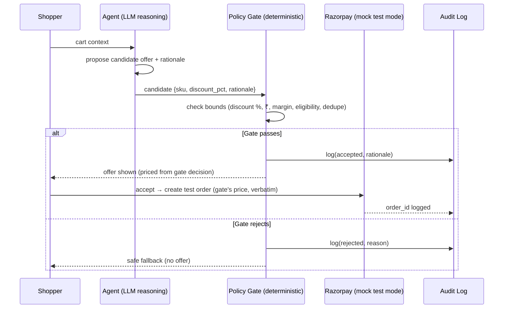

# Upsell & Cross-sell Agent — Explainable, Bounded, Gated

An agentic-commerce demo: given a shopper's cart, an LLM **proposes** one upsell/cross-sell
offer with a rationale, a deterministic **Policy Gate** validates it against merchant bounds,
and only gate-approved pricing can reach the (mock, test-mode) payments layer. Every decision —
accepted or rejected — lands in a queryable **audit trail**.

## Architecture

**Key safety property:** the LLM never computes prices. The gate re-derives the discounted
price from the verified inputs and returns an immutable decision object; order creation uses
that object verbatim.

## Stack (Lovable-native adaptation of the original FastAPI PRD)

| Layer | Choice |
|---|---|
| API | TanStack Start server functions (`src/lib/upsell.functions.ts`) |
| Agent reasoning | Lovable AI Gateway (`google/gemini-3.6-flash`), structured output + heuristic fallback |
| Policy Gate | Plain deterministic TypeScript — `src/lib/policy-gate.ts` |
| Payments | Mock Razorpay Orders adapter — `src/lib/razorpay.server.ts` (swap in `rzp_test_` keys later) |
| Data | Lovable Cloud Postgres: `catalog`, `sessions`, `audit_log` |
| Demo UI | `/` — catalog → cart → offer → gate verdict → audit trail |

## Running the demo

1. Open the app. Add items to the cart, click **Submit cart → agent**.
2. Inspect the agent's candidate, its rationale, and the gate's per-rule PASS/FAIL breakdown.
3. On PASS, **Accept offer** creates a mock test-mode order (`order_MOCK…`, no real money).
4. Browse the **Audit trail** panel — every proposal, gate result, and order is logged.

## The deliberate failure (TOCTOU)

Click **Reproduce failure** to run the legacy broken path: the gate approves 10% off, the
agent mutates the session discount to 85% post-approval, and order creation charges the
mutated value — a ₹2,624.25 mismatch the audit log exposes.

Root cause, fix, and regression test: **[POSTMORTEM.md](./POSTMORTEM.md)**.
Regression tests: `bun test` (see `src/lib/policy-gate.test.ts`).

## Going to real Razorpay test mode

Implement `PaymentsAdapter` in `src/lib/razorpay.server.ts` against
`https://api.razorpay.com/v1/orders` with `rzp_test_` keys stored as secrets, and return it
from `getPaymentsAdapter()`. No other code changes.
